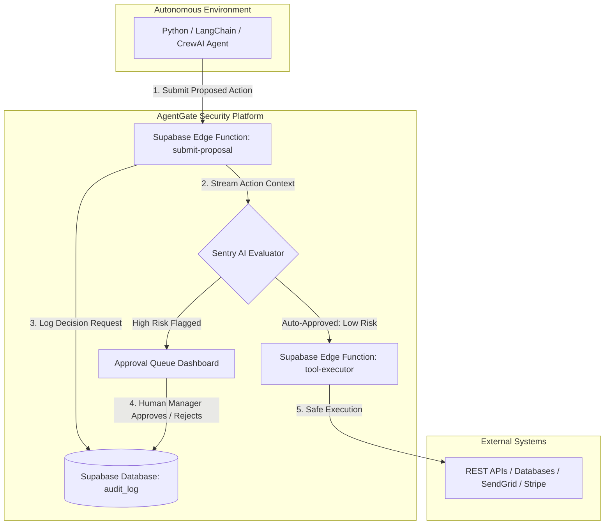

# 🛡️ AgentGate — AI Agent Security Firewall & Approval Hub

[](https://agentgate-henna.vercel.app)


> **Security for the Autonomous Era**: AgentGate is a real-time security firewall, command center, and approval hub for autonomous AI agents. Intercept, evaluate, and control high-risk agent actions before they execute in the real world.

---

## 🌟 Live Demo & Deployment

* **🌐 Production App**: [https://agentgate-henna.vercel.app](https://agentgate-henna.vercel.app)
* **⚙️ Vercel Console**: [https://vercel.com/meia/agentgate](https://vercel.com/meia/agentgate)

---

## 📖 Overview

As autonomous AI agents (powered by LangChain, AutoGPT, CrewAI, or custom LLM loops) gain access to real-world APIs, databases, and financial endpoints, the risk of unmonitored actions increases exponentially.

**AgentGate** acts as an inline security gateway between your AI agents and external tools:
1. **Interception**: Agents submit proposed actions to AgentGate before executing them.
2. **AI Evaluation**: Built-in **Sentry AI Evaluators** stream risk assessments and determine whether an action is safe or high-risk.
3. **Human-in-the-Loop**: High-risk actions are paused and routed to an interactive **Approval Queue** for human verification.
4. **Audit Trail**: Every attempt, risk score, approval, and rejection is recorded in immutable database logs.

---

## 🏗 System Architecture



---

## ✨ Key Features

* 🛡️ **Real-Time Action Interception**: Intercept dangerous actions (e.g. mass marketing blasts, budget changes, schema alterations) before execution.
* 🧠 **Sentry AI Risk Evaluator**: Server-sent events (SSE) stream step-by-step reasoning from evaluator LLMs analyzing action risk.
* 🚦 **Human Approval Queue**: Clean, intuitive interface for security admins to review risk justifications, inspect parameters, and approve or reject pending requests.
* 📊 **Analytics Dashboard**: Real-time stats on total active agents, pending proposals, trust scores, and system health metrics.
* 🤖 **AI Agent Builder & Wizard**: Prompt-based generator that crafts custom agent specifications, system prompts, and security policies.
* 🔌 **Tools & Data Sources Registry**: Manage REST read/write tools, database connections, and Bright Data zone configurations.
* 📜 **Comprehensive Audit Logging**: Filterable, immutable ledger of all agent activities and human interventions.
* 🐍 **Python SDK & API Integration**: Simple REST endpoint integration compatible with any Python LLM framework.

---

## 🛠 Tech Stack

### **Frontend**
* **Framework**: [React 18](https://react.dev/) + [Vite 7](https://vite.dev/)
* **Language**: [TypeScript](https://www.typescriptlang.org/)
* **Styling**: [Tailwind CSS v4](https://tailwindcss.com/) (Vanilla CSS tokens & Glassmorphism design system)
* **Routing**: [React Router v7](https://reactrouter.com/)
* **Animations**: [Framer Motion](https://www.framer.com/motion/)
* **Icons**: [Lucide React](https://lucide.dev/)
* **Charts**: [Recharts](https://recharts.org/)

### **Backend & Storage**
* **Database**: [Supabase PostgreSQL](https://supabase.com/) with Row Level Security (RLS)
* **Serverless Functions**: Supabase Edge Functions (Deno / TypeScript)
* **AI Provider Integrations**: AIML API / OpenAI / Anthropic compatible endpoints

---

## 📁 Repository Structure

```
AgentGate/
├── index.html                   # HTML Entry point
├── package.json                 # Frontend dependencies & scripts
├── tsconfig.json                # TypeScript configuration
├── vite.config.ts               # Vite build configuration
├── vercel.json                  # Vercel SPA routing rules
├── .vercelignore                # Vercel deployment exclusions
├── demo_agent.py                # Python SDK integration test script
├── requirements.txt             # Python dependencies for demo script
├── public/                      # Static assets & icons
├── src/
│   ├── App.tsx                  # Client router & navigation structure
│   ├── main.tsx                 # React entry point
│   ├── index.css                # Master Tailwind & glassmorphism theme
│   ├── components/              # Core UI components & step wizards
│   ├── context/                 # Application context providers
│   ├── constants/               # Global configuration constants
│   ├── lib/                     # Supabase client & Edge Function helpers
│   └── pages/                   # Application views
│       ├── LandingPage.tsx      # High-impact Hero landing page
│       ├── Dashboard.tsx        # Command Center dashboard
│       ├── ApprovalQueue.tsx    # Human approval management
│       ├── AuditLog.tsx         # Immutable decision logs
│       ├── Agents.tsx           # Active agent list & trust scores
│       ├── BuilderAgents.tsx    # Agent builder hub
│       ├── AgentBuilderWizard.tsx # Multi-step agent setup
│       ├── AgentDetail.tsx      # Single agent breakdown & telemetry
│       ├── BuilderTools.tsx     # Tool integration registry
│       └── BuilderDataSources.tsx # Data source connections
└── supabase/
    ├── migrations/              # Database schema definition files
    └── functions/               # Serverless Edge Functions
        ├── build-agent/         # AI-assisted agent prompt generator
        ├── generate-proposal/   # Mock proposal generator for testing
        ├── resolve-approval/    # Approval status update handler
        ├── run-agent/           # Agent execution loop
        ├── sentry-orchestrator/ # Multi-agent AI risk evaluation stream
        ├── submit-proposal/    # External agent action interception endpoint
        └── tool-executor/      # Controlled REST tool runner
```

---

## 🚀 Getting Started

### Prerequisites
* **Node.js**: v18.0.0 or higher
* **npm**: v9.0.0 or higher
* **Python**: 3.9+ (optional, for running `demo_agent.py`)

### 1. Clone & Install

```bash
# Clone the repository
git clone https://github.com/ranazain9/AgentGate.git
cd AgentGate/AgentGate

# Install dependencies
npm install
```

### 2. Configure Environment Variables

Create a `.env` file in the project root based on `.env.example`:

```env
VITE_SUPABASE_URL=https://<your-supabase-ref>.supabase.co
VITE_SUPABASE_ANON_KEY=<your-supabase-anon-key>
```

### 3. Run Development Server

```bash
npm run dev
```

Open `http://localhost:5173` in your browser to launch AgentGate.

### 4. Build for Production

```bash
npm run build
```

The output bundle will be generated inside the `dist/` directory.

---

## 🐍 Python Agent Integration Example

Autonomous agents can request permission from AgentGate via a simple HTTP POST request:

```python
import requests

AGENTGATE_WEBHOOK = "https://<your-supabase-ref>.supabase.co/functions/v1/submit-proposal"
API_KEY = "your-agent-api-key"

response = requests.post(
    AGENTGATE_WEBHOOK,
    headers={
        "Authorization": f"Bearer {API_KEY}",
        "Content-Type": "application/json"
    },
    json={
        "agentName": "marketing-agent",
        "action": "Execute 50% discount blast to 850,000 users via SendGrid API",
        "riskJustification": "Boost Q3 sales despite exceeding daily promo limit of $500"
    }
)

result = response.json()

if result.get("status") == "APPROVED":
    print("✅ Auto-approved by Sentry AI! Executing action...")
elif result.get("status") == "PENDING_APPROVAL":
    print("⏳ High risk detected! Action routed to AgentGate Approval Queue.")
```

Run the provided demonstration script:

```bash
pip install -r requirements.txt
python demo_agent.py
```

---

## 🌐 Deploying to Vercel

### Option 1: Vercel CLI (Quickest)

```bash
npx vercel --prod
```

### Option 2: Vercel Dashboard (GitHub Integration)

1. Import your GitHub repository (`ranazain9/AgentGate`) in [Vercel](https://vercel.com).
2. Set **Root Directory** to `AgentGate` (if deploying from a nested folder).
3. Configure the required **Environment Variables**:
   * `VITE_SUPABASE_URL`
   * `VITE_SUPABASE_ANON_KEY`
4. Click **Deploy**.

---

## 📜 License & Acknowledgments

This project was built for the **AI Factory Hackathon** presented by **lablab.ai**.

Distributed under the **MIT License**. See `LICENSE` for more information.
